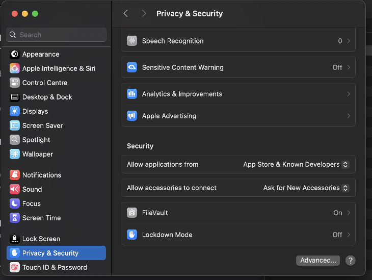

*6502 for Beginners* is the perfect introduction for anyone who wants to dive into the world of 8-bit computing and assembly language programming. This beginner-friendly guide will teach you how to program the 6502 microprocessor, the driving force behind classic machines like the Apple II, Commodore 64, and Atari systems.

No prior experience with assembly language or low-level programming is required—this book takes you from the basics of how the 6502 works to writing your own programs. You’ll explore key concepts like memory, registers, and addressing modes while learning how to control hardware and manage data. Each chapter is packed with clear explanations, hands-on exercises, and practical examples that make learning fun and easy.

By the end of the book, you’ll be able to write simple assembly programs, understand how the 6502 processes instructions, and even create your own small applications for retro computers or emulators. Whether you're a programming enthusiast, a retro computing hobbyist, or just curious about how microprocessors work, *6502 for Beginners* will help you take your first steps into this fascinating world.

**Key Features:**
- Beginner-focused tutorials with clear, step-by-step instructions
- Detailed explanations of the 6502's architecture and core concepts
- Hands-on projects and exercises to reinforce your learning
- Perfect for hobbyists, students, and retro computing fans

Take the leap into 8-bit programming and discover the power of the 6502 with this accessible and engaging guide!

**NOTE FOR ALL USERS**
- Please ensure VSCode is up-to-date
- You don't need to have a 6502 Extension, if you don't want to
- make sure the Java Bin path is included in the environment path variable
 
 
**In VSCode we need to set up some keyboard shortcuts.**

Click the Manage cog (bottom left) and choose Keyboard Shortcuts.
Search for Run Task, click the pencil to edit and select **CTRL-SHIFT-R** then enter (or whatever build key you want).

Click “File” -> “Open Workspace From File” and select the workspace file in the digital bundle you downloaded.

Open the .vscode->tasks.json file (from the panel on the left).

Check and correct if necessary the paths to the KickAss.jar file and the simulator.
  (For this default tasks.json, I had copied the KickAss.jar to the Tools folder and also the simulator into the Tools folder.)

This is not necessary if you correct the paths here.

Also for Linux and mac users, you will need to activate the execution permission on your respective simulator program.

This is done by entering this:
“**sudo chmod +x ca6502Debugger**”
into a terminal window in the directory that supports your operating system,

**NOTE FOR MAC USERS**

The first time it runs the OS will block it and another box will appear on this screen that asks you to confirm its ok

Subsequently it will work fine

